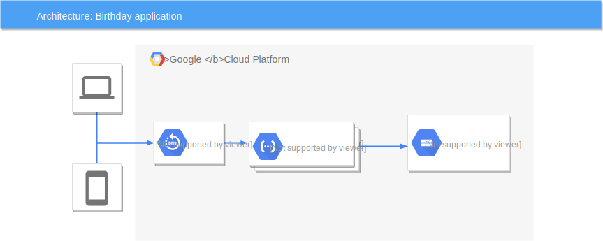

# GCP Typescript Kata

A Typescript practice exercise using Google Cloud Platform (GCP): Google Cloud Functions and Google Cloud Storage.

## The task

…

## The solution

The solution is simple: Create a _Google Cloud Function_ that is callable
over HTTPS and saves the data into _Google Cloud Storage_. 

Google Cloud Functions looked as an ideal solution.

1. The API is simple, no
authentication, rate-limiting or other complication is required.
1. Highly scalable, pay-as-you-go. The zero-downtime requirement is easily
achived. 

Google Cloud Storage has lot of advantages for this task, such as:

1. Highly available, zero downtime
1. Cheap (compared to Cloud SQL, Datastore or running a HA Elastic Search cluster).
1. Based on a unique key (username), it is easy to retrieve.
1. Lifecycle management for less-used objects; archiving.

### The code

The code can be divided into 3 parts:

#### Typescript

An Express application written in Typescript. The `gcpBirthdayMiddleware` is
indeed, a middleware. It is easy to replace to other cloud-specific code
or being extended to with other paths and handlers.

#### Terraform

Responsible to provision the infrastructure: A bucket to store the
Cloud Function code and its previous versions and the storage for the
birthday data.

#### Bash

Shell scripts for CI/CD and the build, inside the `scripts` directory. 

### Testing in the cloud

Call the `https://europe-west1-gcp-typescript-function-kata.cloudfunctions.net/gcp-typescript-kata-birthday/hello/[username]`
endpoint.

### Testing locally

1. Install Docker and Docker Compose.
1. `docker-compose run serverless npm install`
1. `docker-compose run serverless npm run test`. This runs the unit-test suite
would couple of validations.
1. By default, the service occupies `localhost:3333`, but you can map it
anywhere. Take a copy of .env-example and edit the values.
1. To save a birtday, you can use cURL. E.g. `curl -i -X PUT --header "Content-Type: application/json" --data '{"dateOfBirth":"1980-04-07"}' localhost:3333/hello/janos`
1. To retrieve a birthday, you can also use cURL. E.g. `curl -i -X GET --header "Content-Type: application/json" localhost:3333/hello/janos` 

--function gcp-typescript-kata-birthday

### Deploying into Google Cloud

To deploy it into a test environment, I created a Travis integration, but
the least amount of _travisism_ were used, so it is easy to migrate it to
any other CI platform and everything, including the Terraform and build
steps are executed in Docker containers.   

To deploy the app, the following are required:

1. A Google Cloud Platform service account. Download the JSON that contains the
Service Account's credentials and save it as gcp-auth.json in the project root
directory.
1. Enable the [Google Cloud Functions](https://console.developers.google.com/apis/api/cloudfunctions.googleapis.com/overview) and [Google Cloud Compute](https://console.developers.google.com/apis/api/compute.googleapis.com/overview) APIs.
1. Run `scripts/terraform-force-apply.sh account-wide`. On first run, you need
to remove the `gcs` backend, because the bucket is not yet ready to host the
Terraform states. On the 2nd run and going forward, put the `gcs` backend back.
1. Now you can give it a try to run the `scripts/build.sh`. This will build
and pack the Node.js code and uploads it into the function storage bucket.
1. The last step is to run Terraform to _deploy_ the Cloud Function. Run
the `scripts/terraform-plan.sh`, then `scripts/terraform-apply.sh`. At
the moment these are relying on some variables passed by Travis, please
check `scripts/` directory, it is very easy to pass those variables.

## TODO

### If I had more time…

- Add promoted build job and trigger to Travis after the successful Dev
deployment.
- Import `google_project` and `google_project_services` resources into the Terraform state.
- Add authentication and authorisation (candidate: Passport).
- Set up CORS and content compression.
- Multilingual messages, handling the plurals in the messages properly.
- Create healthcheck endpoint to see gather metrics and see the downstream.
services health.
- Encrypt the data store and the Cloud Function storage.

### We can go crazy…

- Set up an API gateway such as Kong to rate-limit, authorise and authenticate. 
- Use Apache OpenWhisk as a function engine and operate it in a Kubernetes /
Openshift cluster.
- Use a more sophisticated database, e.g. ElasticSearch to search and filter
the dates.  
